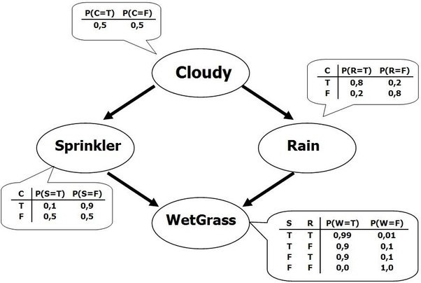
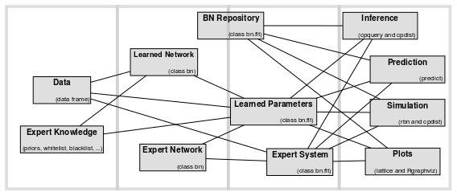

```{r loadlib, include=FALSE}
# install.packages("revealjs")
library(revealjs)
library(visNetwork)
library(dplyr)
library(bnlearn)
library(haven)
library(ggplot2)
library(cowplot)
#BiocManager::install("Rgraphviz")
library(Rgraphviz)
# install.packages("qgraph")
library(qgraph)
#library(ggthemes)
#library(tidyverse)
#library(reshape2)
```


```{r functions, include=FALSE}
Get_Binary_data <- function(Data){
  # checking the data format
  if (!is.data.frame(Data)){
    stop("The Data is not in dataframe format")
  }
  # droping lopnr
  # Selecting Specific Variables under the selection creteria. other_CVD all yes
  drops <- c("lopnr","kohort","urbanization","rhinitis_ever","wheeze_ever")
  Airway2 <- Data[ , !(names(Data) %in% drops)]
  
  # this is only to adjust the smoking varaible to three categories Basically replacing number 0 with Never-Smoker
  Airway2 <- Airway2 %>% mutate(ever_smoker20py=replace(ever_smoker20py, ever_smoker20py==0, 'Never-smoker')) %>% as.data.frame()
  # replacing ever_Somoker variable with integer values
  Airway2$ever_smoker20py <- ifelse(Airway2$ever_smoker20py == 'Never-smoker',0, ifelse(Airway2$ever_smoker20py == '<=20 packyears',1, ifelse(Airway2$ever_smoker20py == '>20 packyears',2,0)))
  # converting the ever_somke to integer variable
  Airway2$ever_smoker20py <- as.integer(Airway2$ever_smoker20py)
  
  Airway2 <- mutate(Airway2, Longstanding_cough = if_else(Longstanding_cough == "Yes", 1L, 0L),
                    Sputum_production = if_else(Sputum_production == "Yes", 1L,0L),
                    Chronic_productive_cough = if_else(Chronic_productive_cough == "Yes", 1L, 0L),
                    Recurrent_wheeze = if_else(Recurrent_wheeze == "Yes", 1L,0L),
                    exp_dust_work = if_else(exp_dust_work == "Yes",1L,0L),
                    gender = if_else(gender == "male", 1L,0L))
  return(Airway2)
}

## Density plot
dist_plot_clust <-function(original_data, selected_variable, variable_name){
  selected_variable <- enquo(selected_variable)
  ggplot(original_data, aes(UQ(selected_variable))) + geom_density(aes(fill = factor(clusters)), alpha=0.8) +
    labs(#title = "Density plot",
         #subtitle="variable of persons Grouped by Clusters",
         #caption="Source: Source: results of Deep Learning Clustering",
         x= variable_name,
         fill="Clusters")
} 

plot.network <- function(structure, ht = "400px"){
  nodes.uniq <- unique(c(structure$arcs[,1], structure$arcs[,2]))
  nodes <- data.frame(id = nodes.uniq,
                      label = nodes.uniq,
                      color = "darkturquoise",
                      shadow = TRUE)
  edges <- data.frame(from = structure$arcs[,1],
                      to = structure$arcs[,2],
                      arrows = "to",
                      smooth = TRUE,
                      shadow = TRUE,
                      color = "black")
  return(visNetwork(nodes, edges, height = ht, width = "100%"))
}
```


# Introduction to Bayesian Network

 

## Correlation and Dependence 

- Two random quantities can be uncorrelated but still be dependent but if they are independent they are necessarily uncorrelated.

- Set of correlated random variables is a subset of set of dependent random variables.

{height=700px, width=700px} 


## Intorduction to Bayesian Network

{height=900px, width=800px} 

## Intorduction to Bayesian Network

- A BNs is a directed acyclic graph in which each edge corresponds to a conditional dependency, and each node corresponds to a unique random variable.
- If an edge exists in the graph connecting random variables $A$ and $B$, it means that $P(B|A)$ is a factor in the joint probability distribution, so we must know $P(B|A)$ for all values of B and A in order to conduct inference.

<!-- - Bayesian networks satisfy the local Markov property, which states that a node is conditionally independent of its non-descendants given its parents. -->

<!-- {height=700px, width=800px} -->

## Reasons to use Bayesian Networks

- <small> Encode the association between all variables (interactive view).</small>
- <small> Encode the association as Conditional Independence structure of variables.</small>
- <small> Generative as opposed to regression as discriminative.</small>
- <small>Casual effect, intervention, Counterfactual and what-if scenario.</small>
- <small>Expert system, Hybrid learning, or learn completly from data.</small>
- <small>BN can be extended into decision models by incorporating decision and utility nodes to automate decisions.</small>


- <small>Multiple outcomes and exposures in one BN model.</small>
- <small>Avoiding the collider bias (feature selection.).</small>
- <small>probability distribution with inference.</small>


## Steps of Building a Bayesian Network Analysis

- Learning the Network structure:
  - Data_driven approach (Score-based approach, Constraint based approach)
  - Expert knowledge approach
  - Hybrid approach (using white and blacklist as constraint)
- Learning the parameter
  - Maximum likelihood estimation 
  - Bayesian Estimation
- Approximate Inference

<!-- ## Reasons to use Bayesian Networks and Graphical Models -->

<!-- - <small>Encode the association between all variables (interactive view).</small> -->
<!-- - Encode the association between all variables (interactive view). -->
<!-- - Encode the association as Conditional Independence structure of variables.  -->
<!-- - Generative as opposed to regression as discriminative. -->
<!-- - Casual effect, intervention, Counterfactual and what-if scenario. -->
<!-- - Expert system, Hybrid learning, or learn completly from data. -->
<!-- - BN can be extended into decision models by incorporating decision and utility nodes to automate decisions.  -->


<!-- ## Reasons to use Bayesian Networks and Graphical Models -->

<!-- - Multiple outcomes and exposures in one BN model. -->
<!-- - Avoiding the collider bias. -->
<!-- - probability distribution with inference.  -->
<!-- - BN as feature selection. -->

# Example of Socioeconomic Airway data

## Learning the Network Structure 
```{r data_preparing, include=FALSE, cache=TRUE}
# preparing the data for fitting
data_all_original <- read_dta("/home/rstudio/socioeconomics/OriginalData/Analysis_dataset(60)25.2.21.dta.dta")
data_all <- data_all_original %>% select(w_asthma, noalle_asthma, alle_asthma) # this data contaitn missing values select only thoses who have a fuull data and no missing
fact_data <- colnames(data_all)
data_all <- data_all %>% mutate_at(fact_data, factor)
# load the mice object
load("/home/rstudio/socioeconomics/Intermediate/outputs/final_mice_model_small.RData")
data_modeling <- mice::complete(imp_parl_final, 20)
data_modeling <- cbind(data_modeling, data_all)
data_modeling <- data_modeling %>% select(- dplyr::matches('varq'))

# load the averaged bootstraped structure
load(file = "/home/rstudio/socioeconomics/Intermediate/outputs/boot_mice_final_small.RData")
# choose a less dense and simpler network
BN_threshold = 0.70
avg.simpler_mice_hc = averaged.network(str.bootstrap_mice, threshold = BN_threshold)
fitted.simpler_mice_hc = bn.fit(avg.simpler_mice_hc, data_modeling)

#
# renameing
# data_modeling <- data_modeling %>% rename(Education = edu_credits, Gender = gender, Age = age, "Job Status" = jabstatus, "Hereditary asthma"= hereditery_asthma, "Hereditery allergy" = hereditery_allergy, "Herditery pulldis" = herditery_pulldis, "Treatment copd" = trt_copd, "Asthma treatment and diagnosis" = asthma_tm, "Current asthma" = c_asthma, "SSYK classification"  = syk_class,"Any symptomps"  =any_smp, "Exposed to dust and gases" = DGF_work, "Smoking status" = smoking_status, "Hereditary lung disease" = her_dis, "Allergic asthma" = alle_asthma, "Socioeconomic_class"=sei_class, "Asthmatic wheeze" = w_asthma, "e-cigarettes amount" = e_amount, "smoke exposure home" = smoke_exphome, "Treatment blood presure" = trt_bp, "Sleep treatment" = trt_sleep, "Number of smoke per day" = s_amount, "No allergic asthma" = noalle_asthma, "Duration" = duration, "Smoke exposure work" = smoke_expwork, "Startage" = startage)

data_modeling <- data_modeling %>% rename(Education = edu_credits, Gender = gender, Age = age, "Job_Status" = jabstatus, "Hereditary_asthma"= hereditery_asthma, "Hereditery_allergy" = hereditery_allergy, "Herditery_pulldis" = herditery_pulldis, "Treatment_copd" = trt_copd, "Asthma_treatment_and_diagnosis" = asthma_tm, "Current_asthma" = c_asthma, "SSYK_classification"  = syk_class,"Any_symptomps"  =any_smp, "Exposed_dust_and_gases" = DGF_work, "Smoking_status" = smoking_status, "Hereditary_lung_disease" = her_dis, "Allergic_asthma" = alle_asthma, "Socioeconomic_class"=sei_class, "Asthmatic_wheeze" = w_asthma, "E_cigarettes_amount" = e_amount, "Smoke_exposure_home" = smoke_exphome, "Treatment_blood_presure" = trt_bp, "Sleep_treatment" = trt_sleep, "Number_of_smoke_per_day" = s_amount, "No_allergic_asthma" = noalle_asthma, "Duration" = duration, "Smoke_exposure_work" = smoke_expwork, "Startage" = startage)
```

## Data Preprocessing

- Missing value imputation
- Variable transformation

## Structure learned from data (Hill-Climbing)

```{r structureLearning, echo=FALSE, warning=FALSE, cache=TRUE}
structure_1 <- hc(data_modeling, score = "bic-cg")
#BN_1 <- bn.fit(structure_1, data = data_modeling)
#plot.network(structure_1, ht = "700px")
qgraph::qgraph(structure_1, layout = "spring", labels = nodes(structure_1))
```

## chalenges

- Overfitting, Bayesian information Criteria
- Stability 

- we can improve the quality of the structure learned from the data by averaging multiple DAGs
- One possible approach to that end is to apply bootstrap resampling.

## Comparing tow different structure learning 
```{r structureLearning2, echo=FALSE, warning=FALSE, message=FALSE}
structure_2 <- tabu(data_modeling, score = "bic-cg")
#BN_2 <- bn.fit(structure_2, data = data_modeling)
par(mfrow = c(1, 2))
graphviz.compare(structure_1, structure_2, shape = "ellipse", main = c("Hill-Climbing", "Difference"))
```


## Bootstap resampling

1. Repeat many times
   - sample a new data set from the original data using either parametric or nonparametric bootstrap;
   - learn the structure of the graphical model for each sample data.
2. Estimate the probability that each possible edge is present in the true network structure.

- This result in arc strength and arc direction.  
- Arcs are considered significant if they appear in at least 85% of the networks, and in the direction that appears most frequently.

## Averaging

```{r bootstrap, echo=FALSE, warning=FALSE, cache=TRUE}
dis_data <- discretize(data = data_modeling %>% select(Duration, Startage), method = "hartemink", breaks = 10, ordered = FALSE, ibreaks=60, idisc="quantile")
#
# final_dis_data <- data_modeling %>% select(-c( duration, startage)) %>% cbind(dis_data) %>% mutate_at(vars(asthma_tm), factor)
final_dis_data <- data_modeling %>% select(-c( Duration, Startage)) %>% cbind(dis_data) 

# single dag build
dis_dag_hc <- hc(final_dis_data, score = "bic-cg")
# bootstrap build
load(file = "./dis_boot_hc.RData")
#dis_boot_hc = boot.strength(final_dis_data, R = 200, algorithm = "hc", algorithm.args = list(score="bic-cg"))
#save(dis_boot_hc, file = "./dis_boot_hc.RData")
# attr(dis_boot_hc, "threshold")
avg_dis_boot_hc = averaged.network(dis_boot_hc)

par(mfrow = c(1, 2))
graphviz.compare(dis_dag_hc, avg_dis_boot_hc, shape = "ellipse", main = c("Hill-Climbing", "average"))
#par(mfrow = c(1, 2))
#graphviz.compare(dis_dag_hc, cextend(avg_dis_boot_hc), shape = "ellipse", main = c("Hill-Climbing", "average"))
```

## Cumulative Distribution of the arcs strength

```{r arcsDistribution, echo=FALSE, warning=FALSE, fig.cap="Cumulative distribution function of the arc strength values computed with bootstrap resampling"}
plot(dis_boot_hc)
abline(v = 0.54, col = "tomato", lty = 2, lwd = 2)
abline(v = 0.70, col = "blue", lty = 2, lwd = 2)
abline(v = 0.89, col = "steelblue", lty = 2, lwd = 2)
```


# Learning the parameters and Validations 

## Cross-validation
```{r CrossValidation1, warning=FALSE, message=FALSE, cache=TRUE, echo=FALSE}
cv_boot_dis_hc <- bn.cv(data = final_dis_data, bn = avg_dis_boot_hc, runs = 5, method = "k-fold", loss = "pred-lw-cg", loss.args = list(target ="Current_asthma"))
```

```{r CrossValidation2, echo=FALSE, cache=TRUE, warning=FALSE, message=FALSE}
cv_boot_dis_hc
```

## Checking generated data

```{r fitting, echo=FALSE, warning=FALSE, cache=TRUE}
# fit the averaged version
avg_dis_boot_hc = averaged.network(dis_boot_hc, threshold = 0.88)
dis_boot_fit <-  bn.fit(cextend(avg_dis_boot_hc), final_dis_data)
```

```{r simvsOrgi, cache=TRUE, include=FALSE, warning=FALSE}
data_sim <- rbn(dis_boot_fit, 2000)
ais_sub = final_dis_data

# compare the synthetic and original data frames
df <- ais_sub %>% 
  mutate(type = "orig") %>% 
  bind_rows(
    rbn(dis_boot_fit, 30000) %>% 
      mutate(type = "sim")
    ) # %>% 
gg_list <- list()
grp_var <- "type"

# df <- df %>% dplyr::rename("E-cigarettes_amount" = "E_cigarettes_amount")
# df <- df %>% select(- c(`E-cigarettes_amount`))
  
vars <- colnames(df)[colnames(df) != grp_var]
for(k in 1:length(vars)){
  var_k <- vars[k]
  gg_list[[k]] <- ggplot(df, aes_string(x = var_k, fill = grp_var, col = grp_var))
  if(is.numeric(df[[var_k]])){
    gg_list[[k]] <- gg_list[[k]] + geom_density(alpha = 0.85, size = 0)
  }else{
    gg_list[[k]] <- gg_list[[k]] + geom_bar(position = "dodge")
  }
  gg_list[[k]] <- gg_list[[k]] + 
    theme(
      axis.text.x = element_text(angle = 90),
      axis.title.x = element_blank()
    ) +
    labs(title = var_k)
}
```


## Original vs Simulated 1

```{r OrVsSim1, echo=FALSE, cache=TRUE}
plot_grid(gg_list[[1]], gg_list[[2]], gg_list[[3]], gg_list[[4]], gg_list[[5]], gg_list[[6]], nrow = 2, ncol = 3)
```

## Original vs Simulated 2

```{r OrVsSim2, echo=FALSE, cache=TRUE}
plot_grid(gg_list[[7]], gg_list[[8]], gg_list[[9]], gg_list[[10]], gg_list[[11]], gg_list[[12]], nrow = 2, ncol = 3)
```

<!-- ## Original vs Simulated 3 -->

<!-- ```{r OrVsSim3, echo=FALSE, cache=TRUE} -->
<!-- plot_grid(gg_list[[13]], gg_list[[14]], gg_list[[15]], gg_list[[16]],gg_list[[17]],gg_list[[18]], nrow = 2, ncol = 3) -->
<!-- ``` -->

## Original vs Simulated 3

```{r OrVsSim4, echo=FALSE, warning=FALSE, message=FALSE, cache=TRUE}
plot_grid(gg_list[[19]], gg_list[[20]], gg_list[[21]], gg_list[[22]],gg_list[[23]],gg_list[[24]], nrow = 2, ncol = 3)
```

# Inference


## Sampling the Condtional Probability Allergic Asthma

- $P[\text{alergic asthma}  | \text{NonSmoker}, \text{age}  \in [44,63], \text{No treatment diabete}, \text{No dust and Gas Exposure},\text{No Hereditary lung disease}]$
- We will sample the conditional probability $1000$ times 

```{r CPInference, cache=TRUE, echo=FALSE, warning=FALSE}
# multiple queries 100
run_1 <- replicate(1000, cpquery(fitted.simpler_mice_hc, event = (alle_asthma == 1) , evidence = (smoking_status == 0 & gender==1 & (age >44 & age < 63) &  trt_diabetes == 0 & her_dis == 0 & DGF_work == 0), n=100000)) # change the name from run_1 to something with more meaningfull like cp_all_asthma_1 

run_2 <- replicate(1000, cpquery(fitted.simpler_mice_hc, event = (c_asthma == 1) , evidence = (smoking_status == 0 & gender==1 & (age >44 & age < 63) & her_dis == 0 & DGF_work == 0 & edu_credits ==4), n=100000)) 

# to get the sampling quantile interval
# to plot the 95% quantile interval with the histgram and the density 
quantile_1 <- quantile(run_1, 0.025)
quantile_2 <- quantile(run_1, 0.975)
```


## Ploting the results

```{r PlotDI, echo=FALSE, cache=TRUE}
ggplot(as.data.frame(run_1), aes(x = run_1)) + geom_histogram(binwidth = 0.0001) + geom_vline(xintercept=quantile_1, color="red", linetype="dashed", size=1) + geom_vline(xintercept=quantile_2, color="red", linetype="dashed", size=1) + geom_density(fill=NA, colour="royalblue") + labs(x= "Conditional Probability of Allergic Asthma")
```

## Sampling the Condtional Probability Asthma

- $P[\text{Asthma}  | \text{NonSmoker}, \text{age}  \in [44,63], \text{No treatment diabete}, \text{No dust and Gas Exposure},\text{No Hereditary lung disease}, \text{2 years high school}]$
- We will sample the conditional probability $1000$ times 

## Ploting the result

```{r CPInference2, echo=FALSE, warning=FALSE, message=FALSE, cache=TRUE}
run_2 <- replicate(1000, cpquery(fitted.simpler_mice_hc, event = (c_asthma == 1) , evidence = (smoking_status == 0 & gender==1 & (age >44 & age < 63) & her_dis == 0 & DGF_work == 0 & edu_credits ==4), n=100000)) 

# to get the sampling quantile interval
# to plot the 95% quantile interval with the histgram and the density 
quantile_2_1 <- quantile(run_2, 0.025)
quantile_2_2 <- quantile(run_2, 0.975)

ggplot(as.data.frame(run_2), aes(x = run_2)) + geom_histogram(binwidth = 0.0001) + geom_vline(xintercept=quantile_2_1, color="red", linetype="dashed", size=1) + geom_vline(xintercept=quantile_2_2, color="red", linetype="dashed", size=1) + geom_density(fill=NA, colour="royalblue") + labs(x= "Conditional Probability of Asthma")
```

## Sampling the Condtional Probability Asthma and gender

- $P[\text{ Asthma and being Male}  | \text{Smoker}, \text{age}  \in [44,63], \text{No treatment diabete}, \text{No dust and Gas Exposure},\text{No Hereditary lung disease}, \text{2 years high school}]$
- Again, we will sample the conditional probability $1000$ times 

## Plotting the resuts

```{r, echo=FALSE, warning=FALSE, message=FALSE, cache=TRUE}
run_3 <- replicate(1000, cpquery(fitted.simpler_mice_hc, event = (c_asthma == 1 & gender == 1) , evidence = (smoking_status == 1 &  her_dis == 1 & DGF_work == 1 & edu_credits ==4), n=100000)) 

# to get the sampling quantile interval
# to plot the 95% quantile interval with the histgram and the density 
quantile_3_1 <- quantile(run_3, 0.025)
quantile_3_2 <- quantile(run_3, 0.975)

ggplot(as.data.frame(run_3), aes(x = run_3)) + geom_histogram(binwidth = 0.0001) + geom_vline(xintercept=quantile_3_1, color="red", linetype="dashed", size=1) + geom_vline(xintercept=quantile_3_2, color="red", linetype="dashed", size=1) + geom_density(fill=NA, colour="royalblue") + labs(x= "Conditional Probability of Asthma and being male")
```

# Thank you for your attention 


